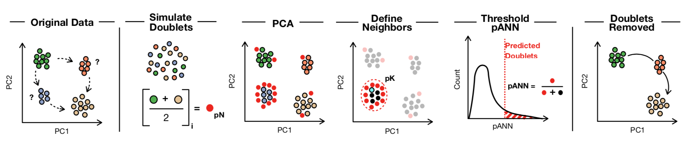
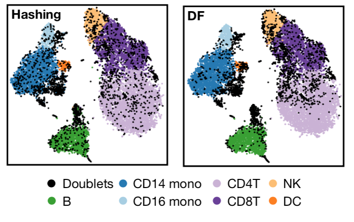
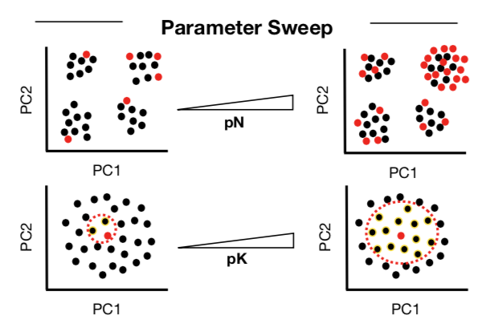
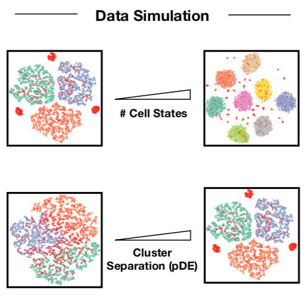
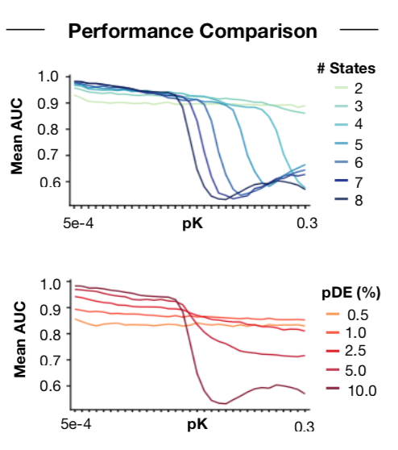
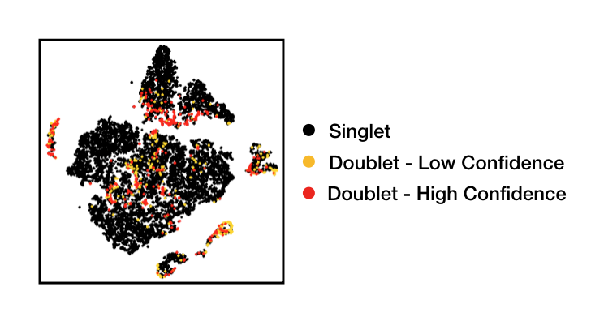

# DoubletFinder

DoubletFinder is an R package that predicts doublets in single-cell RNA sequencing data. 

DoubletFinder is implemented to interface with Seurat >= 2.0 (https://satijalab.org/seurat/) 

DoubletFinder was published by Cell Systems in April, 2019: https://www.cell.com/cell-systems/fulltext/S2405-4712(19)30073-0

## Updates

(06/21/2019) Added parallelization to paramSweep_v3 (thanks NathanSkeen!) -- Note: progress no longer updated, but the process is much faster! Fixed bug with smaller datasets. Updated readme.

(04/12/2019) Added SCTransform compatibilities to 'paramSweep_v3' and 'doubletFinder_v3'

(04/08/2019) Added 'PCs' argument to 'doubletFinder', 'doubletFinder_v3', 'paramSweep', and 'paramSweep_v3' to avoid conflicts with dimension reduction preferences. Updated readme.

(01/12/2019) Seurat V3 compatibility: 'doubletFinder_v3' and 'paramSweep_v3' functions added, other functions for parameter estimation remain compatible.  

## DoubletFinder V2.0 (11/28/2018) 

New Features:
1. Increased computational efficiency during pANN computation
2. Implemented strategy for determining optimal pK values for any scRNA-seq data using pN-pK parameter sweeps and mean-variance-normalized bimodality coefficient (BCmvn)
3. Included vignette describing 'best-practices' for applying DoubletFinder to scRNA-seq data generated without sample multiplexing

## Installation (in R/RStudio)

devtools::install_github('chris-mcginnis-ucsf/DoubletFinder')

## Dependencies

DoubletFinder requires the following R packages: 
* Seurat (>= 2.0) 
* Matrix (1.2.14) 
* fields (9.6) 
* KernSmooth (2.23-15)
* modes (0.7.0)
* ROCR (1.0-7)
* parallel (3.5.1)
* NOTE: These package versions were used in the bioRxiv paper, but other versions may work, as well.

# DoubletFinder Overview

DoubletFinder can be broken up into 4 steps:

(1) Generate artificial doublets from existing scRNA-seq data 

(2) Pre-process merged real-artificial data

(3) Perform PCA and use the PC distance matrix to find each cell's proportion of artificial k nearest neighbors (pANN)

(4) Rank order and threshold pANN values according to the expected number of doublets



DoubletFinder takes the following arguments:

seu ~ This is a fully-processed Seurat object (i.e., after NormalizeData, FindVariableGenes, ScaleData, RunPCA, and RunTSNE have all been run).

PCs ~ The number of statistically-significant principal components, specified as a range (e.g., PCs = 1:10)

pN ~ This defines the number of generated artificial doublets, expressed as a proportion of the merged real-artificial data. Default is set to 25%, based on observation that DoubletFinder performance is largely pN-invariant (see McGinnis, Murrow and Gartner 2019, Cell Systems).

pK ~ This defines the PC neighborhood size used to compute pANN, expressed as a proportion of the merged real-artificial data. No default is set, as pK should be adjusted for each scRNA-seq dataset. Optimal pK values should be estimated using the strategy described below.

nExp ~ This defines the pANN threshold used to make final doublet/singlet predictions. This value can best be estimated from cell loading densities into the 10X/Drop-Seq device, and adjusted according to the estimated proportion of homotypic doublets.

## Application to Cell Hashing and Demuxlet data

DoubletFinder successfully recapitulates ground-truth doublet classifications determined using antibody-barcode sample multiplexing (Cell Hashing) and SNP deconvolution (Demuxlet). DoubletFinder identifies false-negative Demuxlet classifications caused by doublets formed from cells with identical SNP profiles. DoubletFinder is insensitive to homotypic doublets -- i.e., doublets dervied from transcriptionally-similar cell states. 




# 'Best-Practices' for scRNA-seq data generated without sample multiplexing

## Input scRNA-seq Data

* Do not apply DoubletFinder to aggregated scRNA-seq data representing multiple *distinct* samples (e.g., multiple 10X lanes). For example, if you run DoubletFinder on aggregated data representing WT and mutant cell lines sequenced across different 10X lanes, artificial doublets will be generated from WT and mutant cells, which cannot exist in your data. These artificial doublets will skew results. Notably, it is okay to run DoubletFinder on data generated by splitting a single sample across multiple 10X lanes. 

* Ensure that input data is cleared of low-quality cell clusters. There are a variety of ways to do this, but I usually use the following workflow:
1. Manually threshold raw gene expression matrices according to RNA nUMIs (especially important when dealing with super-loaded 10X data because of the way CellRanger threholds data -- See Lun et al., 2019, Genome Biology.
2. Pre-process data using standard workflow.
3. Identify clusters with (A) low RNA UMIs, (B) High % mitochondrial reads, and/or (C) Uninformative marker genes.
4. Remove clusters, pre-process again, and run DoubletFinder.

## pK Selection

ROC analysis across pN-pK parameter sweeps for Cell Hashing and Demuxlet datasets demonstrate that DoubletFinder performance is largely invariant of pN value selection:




ROC analysis across pN-pK parameter sweeps for simulated scRNA-seq data with (I) Variable numbers of cell states and (II) Variable magnitudes of transcriptional heterogeneity demonstrates that (I) Optimal pK value selection depends on the total number of cell states and (II) DoubletFinder performance suffers when applied to transcriptionally-homogenous data. Simulated data was generated using a strategy similar to as described in Wolock, Lopex & Klein 2019, Cell Systems.




Simulated and sample-multiplexed data are unique in that ground-truth doublet classifications can be leveraged to characterize how DoubletFinder parameters must be 'fit' to distinct scRNA-seq datasets. However, doublets remain unknown in real-world contexts -- which is likely why you are interested in DoubletFinder, at all!

To maximize the accuracy of DoubletFinder predictions, we sought a ground-truth-agnostic metric that coincides with pK values that maximize AUC in Cell Hashing and Demuxlet data. Mean-variance normalized bimodality coefficient (BCmvn) achieves this goal, featuring a single, easily-discernible maximum at pK values that optimize AUC. 


BCmvn distributions also feature a single maximum for scRNA-seq datasets generated without sample-multiplexing (e.g., Mouse pancreas, Byrnes et al., 2018, Nature Communcations; Mouse kidney, Park et al., 2018, Science), enabling pK selection.

## Doublet Number Estimation

DoubletFinder is sensitive to heterotypic doublets -- i.e., doublets formed from transcriptionally-distinct cell states -- but is insensitive to homotypic doublets -- i.e., doublets formed from transcriptionally-similar cell states. In our original manuscript, we suggested using DoubletFinder to predict the number of doublets expected from Poisson statistical estimates realting to the droplet microfluidics cell loading density. However, Poisson estimates are agnostic of homotypic doublets, and will thus invariably overestimate the number of *detectable* doublets.

To address this issue, we suggest users utilize literature-supported cell type annotations to model the proportion of homotypic doublets present in their data. As an example, we present an analysis of mouse kidney scRNA-seq data (Park et al., 2018, Science):


Notably, it is conceivable that literature-suppoted cell type annotations may not accurately recapitulate the magnitude of transcriptional divergence necessary for DoubletFinder sensitivity. For example, nominally-homogenous cells (e.g., CD4+ T-cells) may exist along a spectrum of gene expression states (e.g., distinct anatomical locations, disease states, naive/Tregs/Th17 cells, etc.), and doublets formed by cell sub-types may be detectable by DoubletFinder. Thus, we consider doublet number estimates based on Poisson statistics with and without homotypic doublet proportion adjustment to 'bookend' the real detectable doublet rate. 

## Example code for 'real-world' applications

```R
## Pre-process Seurat object (standard) --------------------------------------------------------------------------------------
seu_kidney <- CreateSeuratObject(kidney.data)
seu_kidney <- NormalizeData(seu_kidney)
seu_kidney <- ScaleData(seu_kidney)
seu_kidney <- FindVariableFeatures(seu_kidney, selection.method = "vst", nfeatures = 2000)
seu_kidney <- RunPCA(seu_kidney)
seu_kidney <- RunUMAP(seu_kidney, dims = 1:10)

## Pre-process Seurat object (sctransform) -----------------------------------------------------------------------------------
seu_kidney <- CreateSeuratObject(kidney.data)
seu_kidney <- SCTransform(seu_kidney)
seu_kidney <- RunPCA(seu_kidney)
seu_kidney <- RunUMAP(seu_kidney, dims = 1:10)

## pK Identification (no ground-truth) ---------------------------------------------------------------------------------------
sweep.res.list_kidney <- paramSweep_v3(seu_kidney, PCs = 1:10, sct = FALSE)
sweep.stats_kidney <- summarizeSweep(sweep.res.list_kidney, GT = FALSE)
bcmvn_kidney <- find.pK(sweep.stats_kidney)

## pK Identification (ground-truth) ------------------------------------------------------------------------------------------
sweep.res.list_kidney <- paramSweep_v3(seu_kidney, PCs = 1:10, sct = FALSE)
gt.calls <- seu_kidney@meta.data[rownames(sweep.res.list_kidney[[1]]), "GT"]
sweep.stats_kidney <- summarizeSweep(sweep.res.list_kidney, GT = TRUE, GT.calls = gt.calls)
bcmvn_kidney <- find.pK(sweep.stats_kidney)

## Homotypic Doublet Proportion Estimate -------------------------------------------------------------------------------------
homotypic.prop <- modelHomotypic(annotations)           ## ex: annotations <- seu_kidney@meta.data$ClusteringResults
nExp_poi <- round(0.075*length(seu_kidney@cell.names))  ## Assuming 7.5% doublet formation rate - tailor for your dataset
nExp_poi.adj <- round(nExp_poi*(1-homotypic.prop))

## Run DoubletFinder with varying classification stringencies ----------------------------------------------------------------
seu_kidney <- doubletFinder_v3(seu_kidney, PCs = 1:10, pN = 0.25, pK = 0.09, nExp = nExp_poi, reuse.pANN = FALSE, sct = FALSE)
seu_kidney <- doubletFinder_v3(seu_kidney, PCs = 1:10, pN = 0.25, pK = 0.09, nExp = nExp_poi.adj, reuse.pANN = "pANN_0.25_0.09_913", sct = FALSE)
```



## Other Doublet Detection Methods
[Scrublet](https://github.com/AllonKleinLab/scrublet)
[DoubletDecon](https://github.com/EDePasquale/DoubletDecon)
[DoubletDetection](https://github.com/JonathanShor/DoubletDetection)
## References

1.	Stoeckius M, Zheng S, Houck-Loomis B, Hao S, Yeung BZ, Smibert P, Satija R. Cell Hashing with barcoded antibodies enables multiplexing and doublet detection for single cell genomics. Genome Biol. 2018. 19:224.

2.  Kang HM, Subramaniam M, Targ S, Nguyen M, Maliskova L, McCarthy E, Wan E, Wong S, Byrnes L, Lanata CM, Gate RE, Mostafavi S, Marson A, Zaitlen N, Criswell LA, Ye JC. Multiplexed droplet single-cell RNA-sequencing using natural genetic variation. Nat Biotechnol. 2018; 36(1):89-94. 

3.  Wolock SL, Lopez R, Klein AM. Scrublet: Computational Identification of Cell Doublets in Single-Cell Transcriptomic Data. Cell Syst. 2019. 8(4):281-291.e9.

4.  Park J, Shrestha R, Qiu C, Kondo A, Huang S, Werth M, Li M, Barasch J, Suszták K. Single-cell transcriptomics of the mouse kidney reveals potential cellular targets of kidney disease. Science. 2018; 360(6390):758-63.

5.  Byrnes LE, Wong DM, Subramaniam M, Meyer NP, Gilchrist CL, Knox SM, Tward AD, Ye CJ, Sneddon JB. Lineage dynamics of murine pancreatic development at single-cell resolution. Nat Commun. 2018; 9:3922.

