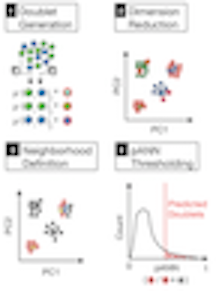
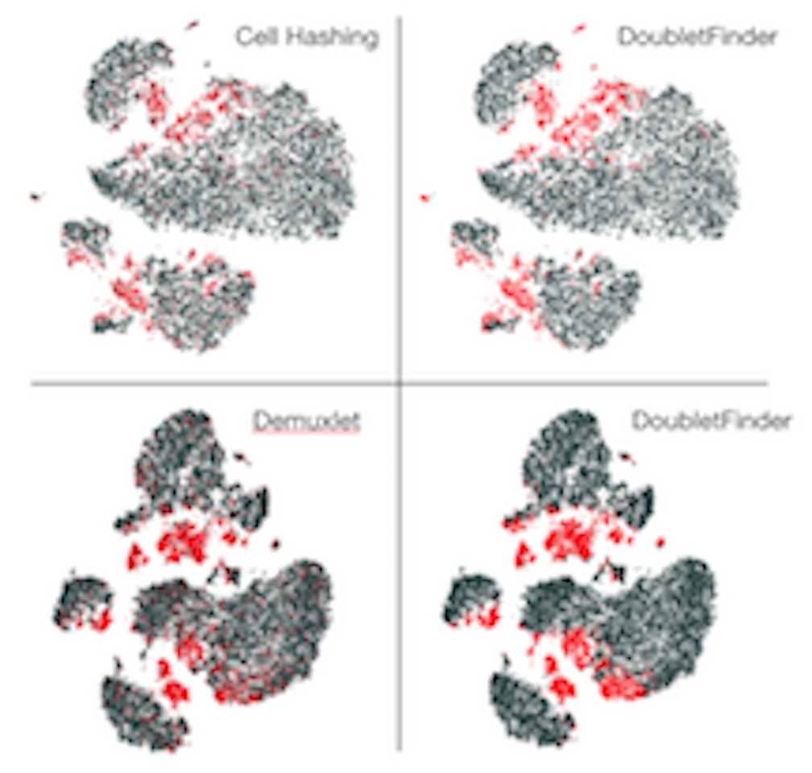

# DoubletFinder
DoubletFinder is an R package that predicts doublets in single-cell RNA sequencing data. 

DoubletFinder is implemented to interface with Seurat (https://satijalab.org/seurat/).

For more information, check out our preprint (https://www.biorxiv.org/content/early/2018/06/20/352484)

## Installation
In R/RStudio:

devtools::install_github('chris-mcginnis-ucsf/doubletFinder')

## Dependencies
DoubletFinder requires the Seurat (>= 2.0) and Matrix R packages

## Usage

DoubletFinder can be broken up into 4 steps:

(1) Generate artificial doublets from existing scRNA-seq data 

(2) Perform PCA on the merged real-artificial data

(3) Calculate the euclidean distance matrix in PC space and find each cell's proportion of artificial nearest neighbors (pANN)

(4) Rank order and threshold pANN values according to the expected number of doublets

DoubletFinder takes the following arguments:

seu ~ This is a fully-processed Seurat object (i.e., after NormalizeData, FindVariableGenes, ScaleData, RunPCA, and RunTSNE ahve all been run).

proportion.artificial ~ This defines the number of generated artificial doublets, expressed as a proportion of the merged real-artificial data. Default is set to 25%, based on previous optimization (see McGinnis, Murrow and Gartner 2018, BioRxiv).

proportion.NN ~ This defines the PC neighborhood size sued to calculate pANN, expressed as a proportion of the merged real-artificial data. Default is set to 1%, based on previous optimization (see McGinnis, Murrow and Gartner 2018, BioRxiv).

expected.doublets ~ This defines the pANN threshold used to make final doublet/singlet predictions. This value can best be estimated from cell loading densities into the 10X/Drop-Seq device.

## Application to Cell Hashing and Demuxlet data (Stoeckius et al., 2017, bioRxiv; Kang et al., 2018, Nature Biotechnology)

